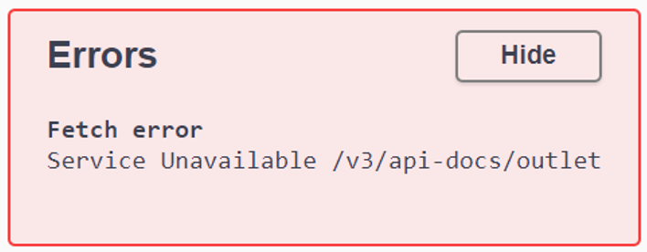

# Приложение для кофейни

## Описание

Приложение для автоматизации работы кофейни на уровне предприятия. 

Доступный функционал:

* создание заказов
* работа с меню
* информация о технологических картах
* информация о складе

## Установка

### Сервер

JDK: Amazon Corretto 17 (corretto-17)<br>
Language level: 17<br>

#### Выбор профиля

* DEV (по умолчанию) - база данных H2
* PROD - база данных [PostgreSQL](README.md#профили)

### Клиент (опционально)

Установить [Node.js (LTS)](https://nodejs.org/en) 

Установка библиотек: 
```shell
npm ci
```

## Варианты запуска

### Сервер

#### Запуск в IntelliJ IDEA

Настройки в файле `.runConfigurations/runAll.run.xml`

Выбрать конфигурацию `runAll` и запустить проект

#### Запуск через NPM (Node.js)

```shell
npm run server
```

#### Ручной запуск (Windows)

1. config-server

```shell
cd server\config-server 
```
```shell
.\mvnw spring-boot:run
```

2. eureka-server

```shell
cd server\eureka-server 
```
```shell
.\mvnw spring-boot:run
```

3. outlet-service

```shell
cd server\outlet 
```
```shell
.\mvnw spring-boot:run
```

4. api-gateway

```shell
cd server\api-gateway 
```
```shell
.\mvnw spring-boot:run
```

### Клиент (опционально)

```shell
npm run client
```

## Использование

### Документация Springdoc OpenAPI (Swagger)

http://localhost:8765/swagger-ui.html

### Веб-интерфейс базы данных H2 (profile DEV)

http://localhost:8081/h2-ui/

### Eureka server

http://localhost:8761/

### Клиент

http://localhost:5173/

## Устранение неполадок

### Failed to load API definition



Перезапустить страницу через 20-60 секунд.

## Профили

Задание профиля в файле
[api-configs/application.yaml](server/config-server/src/main/resources/api-configs/application.yaml)

`spring.cloud.config.profile=dev`<br>
`spring.cloud.config.profile=prod`

### Создание Docker контейнера с PostgreSQL

Создание контейнера на порту 5435

```shell
docker run --name psql-cafe -e POSTGRES_DB=outlet_db -e POSTGRES_USER=sa -e POSTGRES_PASSWORD=p -p 5435:5432 -d postgres:15.5-bullseye
```

Вход в контейнер и в базу данных outlet_db

```shell
docker exec -it psql-cafe psql -U sa outlet_db
```

Вход в базу данных внутри контейнера

```shell
psql -U sa -d outlet_db
```
