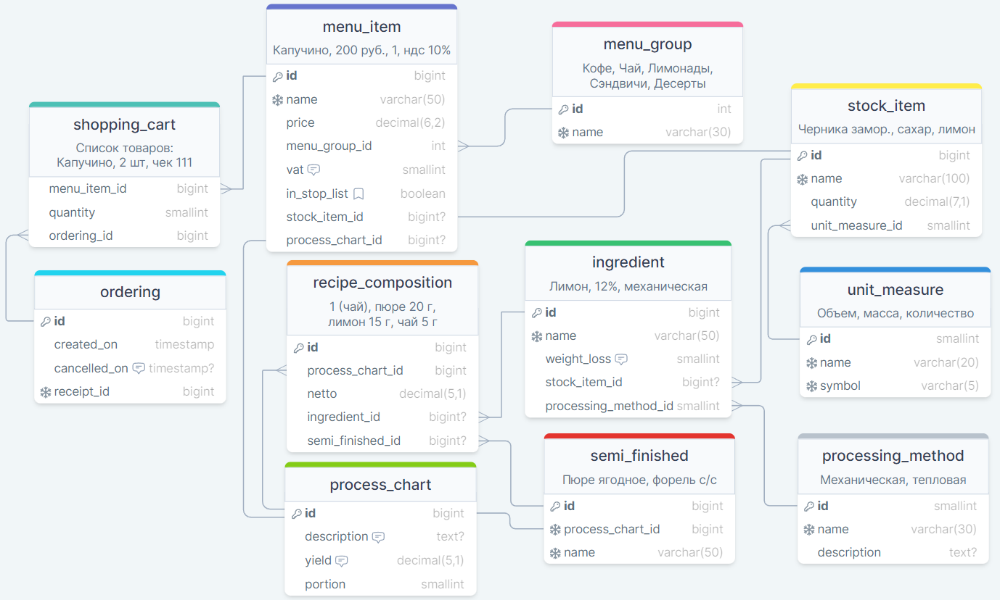

# Сервис для работы с заказами на предприятии

## Схема базы данных



## База данных H2 (profile dev)

[Пользовательский интерфейс](http://localhost:8080/h2-ui/)

## Создание Docker контейнера с postgresql (profile prod)

Создание контейнера на порту 5435
* docker run --name psql-cafe -e POSTGRES_DB=outlet_db -e POSTGRES_USER=sa -e POSTGRES_PASSWORD=p -p 5435:5432 -d postgres:15.5-bullseye

Вход в контейнер и в базу данных outlet_db
* docker exec -it psql-cafe psql -U sa outlet_db

Вход в базу данных внутри контейнера
* psql -U sa -d outlet_db

## Доступные endpoints

[springdoc-openapi:swagger](localhost:8080/swagger-ui/index.html)

[/menu (GET)](http://localhost:8080/menu) - получение списка групп меню

[/menu/group?id=1 (GET)](http://localhost:8080/menu/group?id=1) - получение списка 
позиций меню в группе по ID группы

[/menu/order (POST)](http://localhost:8080/menu/order) - получение ID заказа. 
Записать информацию о заказе в базу и рассчитать расход сырья. 
Данные: ID чека, пары "menuItemId":"quantity"

```json
{
  "receiptId": 5,
  "shoppingCartItems":
  {
    "1": 2,
    "2": 1,
    "3": 1
  }
}
```

