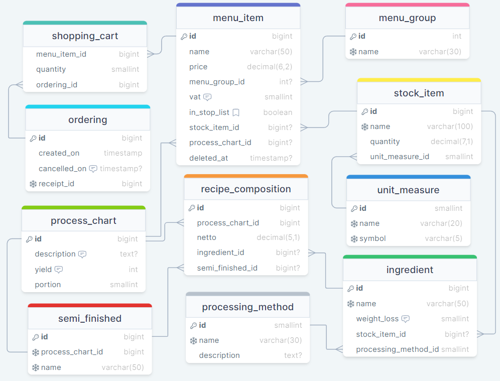

# Дипломный проект

## Тема

**_Разработка веб-приложения для небольшой кофейни с реализацией ограниченного ассортимента
продукции общественного питания с возможностью подключения нескольких филиалов одной сети._**

## Сервисы

1. config-server - сервер для хранения настроек всех микросервисов (Spring Cloud Config)
2. eureka-server - сервер Eureka для обнаружения микросервисов (Spring Cloud Netflix - Eureka Server)
3. outlet-service - сервис для работы с заказами на предприятии
4. api-gateway - сервис для переадресации запросов от клиентского приложения микросервисам

Обращение к сервисам через `http://localhost:8765/{service_name}/{path}`

## Доступные endpoints

### outlet-service (тестовые данные)

1. [(POST) /order](http://localhost:8765/outlet/order) - получение ID заказа.
   Записать информацию о заказе в базу и рассчитать расход сырья.

```json
{
  "receiptId": 8,
  "shoppingCartItems": [
    {
      "menuItemId": 1,
      "quantity": 2
    },
    {
      "menuItemId": 2,
      "quantity": 1
    },
    {
      "menuItemId": 3,
      "quantity": 1
    }
  ]
}
```

2. [(POST) /menu/group](http://localhost:8765/outlet/menu/group) - создание новой группы меню

```json
{
  "name": "кофе"
}
```

3. [(POST) /menu/item/stock](http://localhost:8765/outlet/menu/item/stock) - создание позиции меню, связанной
   с позицией на складе

```json
{
  "name": "вода н/г 0.5 л, пластик",
  "price": 100,
  "vat": null,
  "menuGroupId": 2,
  "stockItemId": 12
}
```

```json
{
  "name": "Зерно Бразилия, 250 г",
  "price": 750,
  "vat": 20,
  "menuGroupId": 2,
  "stockItemId": 13
}
```

4. [(POST) /stock/shipment](http://localhost:8765/outlet/stock/shipment) - принятие
   новой поставки продуктов. Данные: ID позиции на складе в outlet (StockItem, Long),
   количество в штуках (без дробной части), миллилитрах или граммах (Double).
   Возвращает список непринятых позиций (ID позиции).

```json
[
  {
    "stockItemId": 1,
    "quantity": 49
  },
  {
    "stockItemId": 3,
    "quantity": 215.5
  },
  {
    "stockItemId": 6,
    "quantity": 12
  }
]
```

5. [(POST) /stock](http://localhost:8765/outlet/stock) - создание новой позиции на складе

```json
{
  "name": "сыр творожный сливочный",
  "unitMeasureId": 1
}
```

6. [(POST) /ingr](http://localhost:8765/outlet/ingr) - создание нового ингредиента

```json
{
  "name": "молотый кофе, Бразилия",
  "processingMethodId": 4,
  "weightLoss": 3,
  "stockItemId": 14
}
```

7. [(POST) /ingr/pm](http://localhost:8765/outlet/ingr/pm) - создание нового метода обработки

```json
{
  "name": "выпекание",
  "description": null
}
```

8. [(POST) /cook/sf](http://localhost:8765/outlet/cook/sf) - создание нового полуфабриката

```json
{
  "name": "лимонный сок",
  "processChart": {
    "description": "Лимонный фреш.",
    "yield": 100,
    "portion": 1
  },
  "recipeCompositions": [
    {
      "netto": 160,
      "ingredientId": 3,
      "semiFinishedId": null
    }
  ]
}
```

9. [(POST) /menu/item/pc](http://localhost:8765/outlet/menu/item/pc) - создание новой позиции меню, связанной
   с техкартой

```json
{
  "name": "лимонад с лимоном и огурцом",
  "price": 180,
  "vat": 10,
  "menuGroupId": 4,
  "processChart": {
    "description": "Насыпать лед, положить дольку лимона и нарезанный слайсами огурец, залить минералкой.",
    "yield": 300,
    "portion": 1
  },
  "recipeCompositions": [
    {
      "netto": 150,
      "ingredientId": 2,
      "semiFinishedId": null
    },
    {
      "netto": 20,
      "ingredientId": 3,
      "semiFinishedId": null
    },
    {
      "netto": 30,
      "ingredientId": 10,
      "semiFinishedId": null
    },
    {
      "netto": 130,
      "ingredientId": 13,
      "semiFinishedId": null
    }
  ]
}
```

## Схема базы данных

### Сервис Outlet

